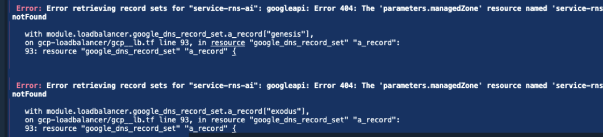

# RNS Terraform Modules

This repository contains Terraform modules for deploying Google Cloud Platform (GCP) infrastructure, including:

- **Cloud Run Services**
- **PostgreSQL Databases**
- **Load Balancer Services**

Each module is located in its respective file and can be enabled by setting the appropriate `create_*` variable to `true`.

---

## How to Use

1. **Navigate to the Desired Module:**
   - To deploy a Cloud Run service, navigate to the `module_cloudrun.tf` file.
   - To deploy a PostgreSQL database, navigate to the `module_db.tf` file.
   - To deploy a Load Balancer service, navigate to the `module_lb.tf` file.

2. **Enable the Module:**
   - Inside each module file, there is a variable named `create_*` (e.g., `create_cloudrun`, `create_database`, `create_loadbalancer`).
   - To enable the creation of any or all of the resources, set the corresponding variable to `true`.

---

## Module Details

### 1. **Cloud Run Module (`module_cloudrun.tf`)**
- **Description**: This module is used to create a GCP Cloud Run service.
- **Configuration**: 
  - Enable by setting `create_cloudrun = true`.
  - Customize the service by modifying parameters such as:
    - `project_id`: GCP Project ID.
    - `stage`: Environment stage (e.g., `prod`).
    - `image_name`: The name of the container image.
    - `max_concurrency`, `max_instances`, `port`: Define concurrency and port settings.

### 2. **Database Module (`module_db.tf`)**
- **Description**: This module sets up a PostgreSQL database on GCP.
- **Configuration**: 
  - Enable by setting `create_database = true`.
  - Configure the following parameters:
    - `project_id`: GCP Project ID.
    - `stage`: Environment stage (e.g., `prod`).
    - `db_version`: Version of PostgreSQL (e.g., `POSTGRES_15`).
    - `db_instances`: Configure database instance details such as disk size, instance name, and flags.

### 3. **Load Balancer Module (`module_lb.tf`)**
- **Description**: This module provisions a GCP Load Balancer.
- **Configuration**:
  - Enable by setting `create_loadbalancer = true`.
  - Parameters include:
    - `project_id`: GCP Project ID.
    - `loadbalancer_name`: Name of the load balancer.
    - `frontend_config_map`: Define frontend configuration for routing traffic to backend buckets.

---

## Example Usage

### Enable Cloud Run:
In the `module_cloudrun.tf` file, set:

```hcl
create_cloudrun = true

## NOTE
if you fail to set a project id that has no dnszone or 
domain existing in it you would get this error so make sure 
if you are testing the loadbalancer, set these three values 
and make sure they exist in the sprcified project.

domain_name               = "genesis.service.rns.ai."  # Example existing frontend domain
dnszone                   = "service-rns-ai"           # MAKE SURE THIS DNSZONE EXISTS IN THE PROJECT
dnszone_project_id        = "MY_PROJECT_ID"            # THIS IS THE PROJECT ID OF THE DNSZONE: 
                                                       # SEE README FOR ERROR IF THIS IS NOT SET CORRECTLY
```

Feel free to email me for further questions

